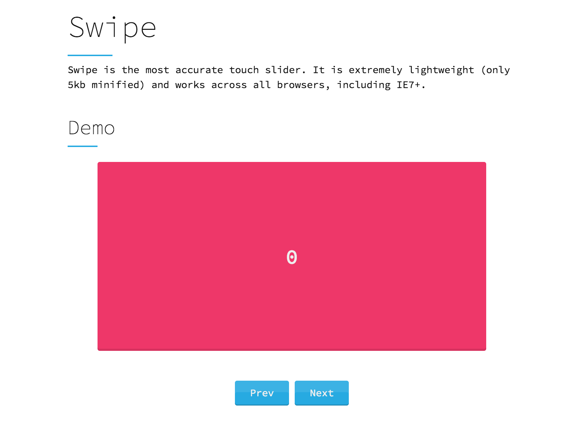

Swipe
=====

[](https://codeclimate.com/github/lyfeyaj/swipe)

Swipe is the most accurate touch slider. It is extremely lightweight (only 5kb minified) and works across all browsers, including IE7+.

## Note

This repo is a continuation of the dead [Swipe](https://github.com/thebird/Swipe) project. Our mission is to keep Swipe alive and moving forward, with maintenance fixes and new features. Pull Requests are welcome!

## React Support

Please go to [react swipe plugin](react), or check the [example](examples/react)

## Usage

### Preview

[](http://lyfeyaj.github.io/swipe/)

Thanks to [@loup-brun](https://github.com/loup-brun)

### Installation

You can install this package directly via Bower `bower install swipe-js` or NPM `npm install swipejs`.

See the [online example](http://lyfeyaj.github.io/swipe/) for a simple demo.

### Markup

Swipe requires just a few lines of markup. Here is an example:

``` html
<div id="slider" class="swipe">
  <div class="swipe-wrap">
    <div></div>
    <div></div>
    <div></div>
  </div>
</div>
```

Above is the initial required structure– a series of elements wrapped in two containers. Place any content you want within the items. The containing `div` will need to be passed to the Swipe function like so:

### Style

Swipe requires the following styles to be added to your stylesheet:

``` css
.swipe {
  overflow: hidden;
  visibility: hidden;
  position: relative;
}
.swipe-wrap {
  overflow: hidden;
  position: relative;
}
.swipe-wrap > div {
  float: left;
  width: 100%;
  position: relative;
  overflow: hidden;
}
```

### Javascript

You may initialize a Swipe slider with only one line of javascript code:

``` js
window.mySwipe = new Swipe(document.getElementById('slider'));
```

I always place this at the bottom of the page, externally, to verify the page is ready.

## Config Options

Swipe can take an optional second parameter– an object of key/value settings:

- **startSlide** Integer *(default: `0`)*: index position at which Swipe should start.
- **speed** Integer *(default: `300`)*: speed of prev and next transitions in milliseconds.
- **auto** Integer: when specified, start an auto-playing slideshow (time in milliseconds between slide change).
- **draggable** Boolean *(default: `false`)*: enable mouse drag support in desktop browsers.
- **continuous** Boolean *(default: `true`)*: create an infinite feel with no endpoints.
- **autoRestart** Boolean *(default: `false`)*: auto restart slideshow after user's touch event or next/prev calls.
- **disableScroll** Boolean *(default: `false`)*: prevent any touch events on this container from scrolling the page.
- **stopPropagation** Boolean *(default: `false`)*: stop event propagation.
- **callback** Function *(default: `function() {}`)*: runs at slide change.
- **transitionEnd** Function *(default: `function() {}`)*: runs at the end of a slide transition.

### Example

``` js
window.mySwipe = new Swipe(document.getElementById('slider'), {
  startSlide: 0,
  speed: 400,
  auto: 3000,
  draggable: false,
  continuous: true,
  disableScroll: false,
  stopPropagation: false,
  callback: function(index, elem) {},
  transitionEnd: function(index, elem) {}
});
```

## API

A Swipe instance exposes the following public methods:

- `prev()` slide to the previous slide.
- `next()` slide to the next slide.
- `getPos()`: return the current slide index position.
- `getNumSlides()`: return the number of slides.
- `slide(index, duration)`: slide to the position matching the `index` (integer) (`duration`: speed of transition in milliseconds).
- `restart()`: restart the slideshow with autoplay.
- `stop()`: stop the slideshow and disable autoplay.
- `setup()`: reinitialize swipe.
- `kill()`: completely remove the Swipe instance.

## Browser Support
Swipe is now compatible with all browsers, including IE7+. Swipe works best on devices that support CSS transforms and touch events, but can be used without these as well. A few helper methods determine touch and CSS transition support and choose the proper animation methods accordingly.

## Who's using Swipe


Send me a [note](mailto:lyfeyaj@gmail.com) if you want your logo here

## TODOs

+ Refactor `swipe.js` for better code structure

## License

[The MIT License (MIT)](http://opensource.org/licenses/MIT).
